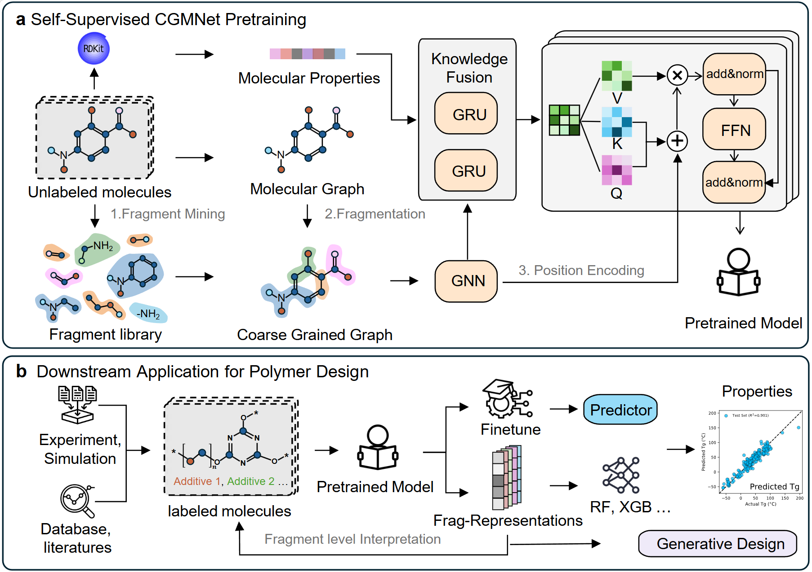

# CGMNet

CGMNet (Coarse-Grained Molecular Network) is a fragment-based pre-training framework for polymer property prediction.

## About

This repository contains the official implementation of CGMNet, including the code and scripts for data preparation, pre-training, fine-tuning, evaluation, and representation export. To facilitate reproducibility, the datasets and data splits used in this work are also organized in this repository. In particular, the `jobs/` directory stores the original data files, together with the processed `.npy` and `.csv` files used in pre-training and downstream experiments. The following sections describe how to use the codebase and provide download links and reproduction guidelines for the datasets, model checkpoints, and processing pipeline.

## Overview of the framework

<p align="center">
  
</p>

## Environment

Please first set up the runtime environment for CGMNet.

```bash
conda create -n CGMNet python=3.11
conda activate CGMNet
pip install torch==2.4.0 torchvision==0.19.0 torchaudio==2.4.0 --index-url https://download.pytorch.org/whl/cu121
pip install --pre dgl -f https://data.dgl.ai/wheels-test/torch-2.4/cu121/repo.html
pip install rdkit scipy numpy pandas tqdm scikit-learn pandas-flavor seaborn e3fp lmdb
pip install https://data.pyg.org/whl/torch-2.4.0%2Bcu121/torch_scatter-2.1.2%2Bpt24cu121-cp311-cp311-linux_x86_64.whl
cd scripts
````

No additional installation steps are required for this repository. After configuring the environment above, all commands in this README can be executed directly from the `scripts/` directory.

## Pre-training data preparation

This section describes how to prepare the data used for pre-training, including vocabulary construction, feature generation, and LMDB building.

### Step 1: Build vocabulary

```bash
python 01_build_vocabulary.py --frag_method [FRAG_METHOD] --input_smi_path ../jobs/[PRETRAIN_SMILES_FILE].smi --output_dir ../jobs/pretrain_dataset/[RUN_NAME]
```

Example:

```bash
python 01_build_vocabulary.py --frag_method brics_overlap --input_smi_path ../jobs/pretrain_dataset/pretrain.smi --output_dir ../jobs/pretrain_dataset/1_brics_overlap
python 01_filter_vocab.py  --input_vocab  ../jobs/pretrain_dataset/1_brics_overlap/vocabs/vocab.txt   --input_vocab  ../jobs/pretrain_dataset/1_brics_overlap/vocabs/vocab.txt --max_atoms 25   --min_count 5
```

### Step 2: Generate features

```bash
python 02_generate_features.py --mode pretrain --input_path ../jobs/pretrain_dataset/[RUN_NAME]/data/cleaned.smi --n_jobs [N_JOBS]
```

Example:

```bash
python 02_generate_features.py --mode pretrain --input_path ../jobs/pretrain_dataset/1_brics_overlap/data/cleaned.smi --n_jobs 16
```

### Step 3: Build LMDB files

```bash
python 03_build_lmdb.py --frag_method [FRAG_METHOD] --smi_file ../jobs/pretrain_dataset/[RUN_NAME]/data/cleaned.smi --vocab_path ../jobs/pretrain_dataset/[RUN_NAME]/vocabs/vocab_filtered.txt --path_max_length [PATH_MAX_LENGTH] --n_jobs [N_JOBS]
```

Example:

```bash
python 03_build_lmdb.py --frag_method brics_overlap   --smi_file   ../jobs/pretrain_dataset/1_brics_overlap/data/cleaned.smi --vocab_path ../jobs/pretrain_dataset/1_brics_overlap/vocabs/vocab_filtered.txt --path_max_length 5
```

## Pre-training

This section describes how to pre-train CGMNet from scratch, or how to use the released pre-trained checkpoints.

```bash
CUDA_VISIBLE_DEVICES=[GPU_IDS] torchrun --nproc_per_node=[N_GPU] --rdzv_endpoint="localhost:[PORT]" 04_pretrain.py --vocab_path ../jobs/pretrain_dataset/[RUN_NAME]/vocabs/vocab_filtered.txt --lmdb_path ../jobs/pretrain_dataset/[RUN_NAME]/lmdb --descriptor_root ../jobs/pretrain_dataset/[RUN_NAME]/features --save_path ../jobs/pretrain_models/[MODEL_NAME] --knodes ecfp maccs torsion md --n_steps [N_STEPS] --batch_size [BATCH_SIZE] --n_threads [N_THREADS] --ddp_find_unused_parameters
```

Example:

```bash
CUDA_VISIBLE_DEVICES=0 nohup torchrun --nproc_per_node=1 --rdzv_endpoint="localhost:29502" 04_pretrain.py --vocab_path ../jobs/pretrain_dataset/1_brics_vanilla/vocabs/vocab_filtered.txt --lmdb_path ../jobs/pretrain_dataset/1_brics_vanilla/lmdb --descriptor_root ../jobs/pretrain_dataset/1_brics_vanilla/features --save_path ../jobs/pretrain_models/pretrain_10sep --knodes ecfp maccs torsion md --n_steps 1000 --batch_size 2000 --n_threads 16 --ddp_find_unused_parameters > 04_pretrain.log 2>&1 &
```

## Fine-tuning data preparation

This section describes how to prepare downstream datasets and data splits for fine-tuning experiments.

### Step 1: Generate downstream features

```bash
python 02_generate_features.py --mode finetune --input_path ../jobs/[DOWNSTREAM_ROOT] --datasets [DATASET_NAME] --n_jobs [N_JOBS]
```

### Step 2: Create dataset splits

```bash
python 05_split_csv.py --data_path ../jobs/[DOWNSTREAM_ROOT]/[DATASET_NAME]/[DATASET_FILE].csv --smiles_col [SMILES_COLUMN] --seeds [SEED_1] [SEED_2] [SEED_3]
```

Example:

```bash
python 02_generate_features.py --mode finetune --input_path ../jobs/MoleculeNet --datasets lipo
python 05_split_csv.py --data_path ../jobs/MoleculeNet/lipo/lipo.csv --smiles_col smiles --seeds 0 1 2
```

## Fine-tuning

This section describes how to fine-tune CGMNet on downstream property prediction tasks.

```bash
CUDA_VISIBLE_DEVICES=[GPU_IDS] python 06_finetune.py --model_path ../jobs/pretrain_models/[MODEL_NAME]/model_final.pth --dataset [DATASET_NAME] --dataset_root ../jobs/[DOWNSTREAM_ROOT] --vocab_path ../jobs/pretrain_dataset/[RUN_NAME]/vocabs/vocab_filtered.txt --save_path ../jobs/[DOWNSTREAM_ROOT]/[DATASET_NAME]/finetuned --epochs [EPOCHS] --batch_size [BATCH_SIZE] --knodes ecfp maccs torsion md --d_model [D_MODEL] --n_mol_layers [N_MOL_LAYERS] --n_heads [N_HEADS] --path_max_length [PATH_MAX_LENGTH]
```

Example:

```bash
CUDA_VISIBLE_DEVICES=0 nohup python 06_finetune.py --model_path ../jobs/pretrain_models/[MODEL_NAME]/model_final.pth --dataset lipo --dataset_root ../jobs/MoleculeNet --vocab_path ../jobs/pretrain_dataset/[RUN_NAME]/vocabs/vocab_filtered.txt --save_path ../jobs/MoleculeNet/lipo/finetuned --epochs 1000 --batch_size 32 --knodes ecfp maccs torsion md --d_model 768 --n_mol_layers 12 --n_heads 12 --path_max_length 5 > 06_finetune.log 2>&1 &
```

## Extracting molecular and fragment representations

This section describes how to use CGMNet to extract molecular-level and fragment-level representations for customized datasets.

```bash
python 07_export_representations.py --model_path ../jobs/pretrain_models/[MODEL_NAME]/model_final.pth --dataset [DATASET_NAME] --dataset_root ../jobs/[DOWNSTREAM_ROOT] --vocab_path ../jobs/pretrain_dataset/[RUN_NAME]/vocabs/vocab_filtered.txt --save_path ../jobs/[DOWNSTREAM_ROOT]/[DATASET_NAME]/representations [OTHER_ARGS]
```

Please replace `[OTHER_ARGS]` with the actual arguments supported by your local version of `07_export_representations.py`.

## Applications in complex polymer systems

This section describes how to apply CGMNet to complex polymer systems, including the corresponding data organization and usage pipeline.

### Step 1: Generate features

```bash
python 02_generate_features.py --mode finetune --input_path ../jobs/[POLYMER_ROOT] --datasets [DATASET_NAME] --n_jobs [N_JOBS]
```

### Step 2: Create dataset splits

```bash
python 05_split_csv.py --data_path ../jobs/[POLYMER_ROOT]/[DATASET_NAME]/[DATASET_FILE].csv --smiles_col [SMILES_COLUMN] --seeds [SEED_1] [SEED_2] [SEED_3]
```

### Step 3: Fine-tune on polymer tasks

```bash
CUDA_VISIBLE_DEVICES=[GPU_IDS] python 06_finetune.py --model_path ../jobs/pretrain_models/[MODEL_NAME]/model_final.pth --dataset [DATASET_NAME] --dataset_root ../jobs/[POLYMER_ROOT] --vocab_path ../jobs/pretrain_dataset/[RUN_NAME]/vocabs/vocab_filtered.txt --save_path ../jobs/[POLYMER_ROOT]/[DATASET_NAME]/finetuned --epochs [EPOCHS] --batch_size [BATCH_SIZE] --knodes ecfp maccs torsion md --d_model [D_MODEL] --n_mol_layers [N_MOL_LAYERS] --n_heads [N_HEADS] --path_max_length [PATH_MAX_LENGTH]
```

The same preprocessing and fine-tuning pipeline can be applied to datasets organized under directories such as `jobs/Polymer_homopolymer` and `jobs/Polymer_heterogeneous`.

## Reproducibility of the results reported in the paper

This section provides the information required to reproduce the main results reported in our paper, including dataset splits, processed files, checkpoints, and evaluation settings. The data for the minimal reproducible version can be downloaded from the following [**link**](https://drive.google.com/drive/folders/1k9jSGF7fjPRb9M_cpcz7f5OUssACbtel?usp=drive_link).

### Datasets and processed files

The datasets and data splits used in this work are organized under the `jobs/` directory. This includes the original data files, as well as the processed `.npy` and `.csv` files used in pre-training and downstream experiments.

A typical pre-training data preparation pipeline is:

```bash
python 01_build_vocabulary.py --frag_method [FRAG_METHOD] --input_smi_path ../jobs/[PRETRAIN_SMILES_FILE].smi --output_dir ../jobs/pretrain_dataset/[RUN_NAME]
python 02_generate_features.py --mode pretrain --input_path ../jobs/pretrain_dataset/[RUN_NAME]/data/cleaned.smi --n_jobs [N_JOBS]
python 03_build_lmdb.py --frag_method [FRAG_METHOD] --smi_file ../jobs/pretrain_dataset/[RUN_NAME]/data/cleaned.smi --vocab_path ../jobs/pretrain_dataset/[RUN_NAME]/vocabs/vocab_filtered.txt --path_max_length [PATH_MAX_LENGTH] --n_jobs [N_JOBS]
```

### Model checkpoints

Released model checkpoints should be placed under `jobs/pretrain_models/[MODEL_NAME]`.

```bash
# Download links will be provided here.
```

### Reproducing the reported results

A typical reproduction workflow is:

```bash
python 02_generate_features.py --mode finetune --input_path ../jobs/[DOWNSTREAM_ROOT] --datasets [DATASET_NAME] --n_jobs [N_JOBS]
python 05_split_csv.py --data_path ../jobs/[DOWNSTREAM_ROOT]/[DATASET_NAME]/[DATASET_FILE].csv --smiles_col [SMILES_COLUMN] --seeds [SEED_1] [SEED_2] [SEED_3]
CUDA_VISIBLE_DEVICES=[GPU_IDS] python 06_finetune.py --model_path ../jobs/pretrain_models/[MODEL_NAME]/model_final.pth --dataset [DATASET_NAME] --dataset_root ../jobs/[DOWNSTREAM_ROOT] --vocab_path ../jobs/pretrain_dataset/[RUN_NAME]/vocabs/vocab_filtered.txt --save_path ../jobs/[DOWNSTREAM_ROOT]/[DATASET_NAME]/finetuned --epochs [EPOCHS] --batch_size [BATCH_SIZE] --knodes ecfp maccs torsion md --d_model [D_MODEL] --n_mol_layers [N_MOL_LAYERS] --n_heads [N_HEADS] --path_max_length [PATH_MAX_LENGTH]
```

If needed, these commands can also be executed with `nohup` for background running.

## Citation

If you find this repository useful, please cite our paper.

```bibtex
@article{
doi:10.26434/chemrxiv.15001561/v1,
author = {Jianxin He  and Subhamoy Mahajan  and Nathaniel Straight  and Ying Li },
title = {BRIDGING SMALL MOLECULES AND POLYMERS: A COARSE-GRAINED GRAPH PRETRAINING FRAMEWORK FOR POLYMER PROPERTY PREDICTION},
journal = {ChemRxiv},
volume = {2026},
number = {0402},
pages = {},
year = {2026},
doi = {10.26434/chemrxiv.15001561/v1},
URL = {https://chemrxiv.org/doi/abs/10.26434/chemrxiv.15001561/v1},
eprint = {https://chemrxiv.org/doi/pdf/10.26434/chemrxiv.15001561/v1}}
```

## License
CGMNet is licensed under the Apache License, Version 2.0. See the [LICENSE](LICENSE) file for details.

